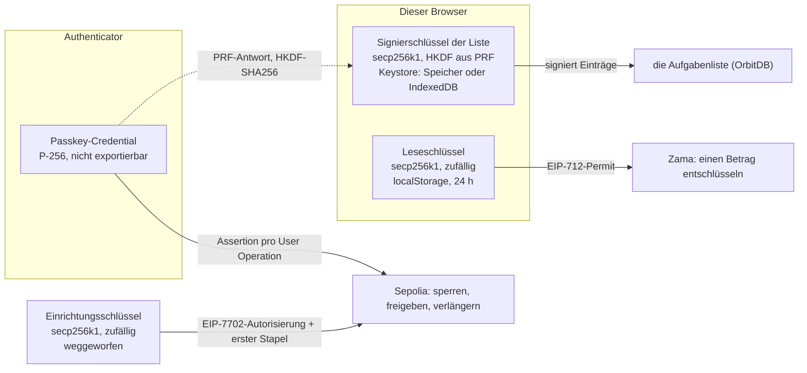

# Vier Schlüssel, ein Passkey

Dieses Kapitel sagt, der Passkey sei die Wallet. Das stimmt, und es verdeckt etwas: wer genau
hinsieht, findet vier verschiedene Schlüssel. Einer liegt im Authenticator. Einer wird aus ihm
abgeleitet. Einer entsteht und verschwindet in derselben Minute. Und einer ist weder abgeleitet noch
in Hardware — ein gewöhnlicher Zufallsschlüssel, der im `localStorage` dieses Browsers liegt.

Die Frage, aus der diese Seite entstanden ist, war, ob das Konto mit dem eigenen P-256-Schlüssel des
Passkeys signiert oder mit einem Schlüssel, der jedes Mal frisch aus der PRF-Antwort des Passkeys
abgeleitet wird. Es signiert mit dem Credential-Schlüssel selbst: jede User Operation trägt eine
WebAuthn-Assertion über ihren eigenen Hash, und Sepolia prüft sie. Aus PRF wird der Signierschlüssel
für die Aufgabenliste abgeleitet und nichts, was die Kette betrifft. Sorgen muss man sich um den
vierten machen, den Leseschlüssel für Zamas Entschlüsselung — und diese Seite sagt, warum er
existiert, was sich im August 2026 bei Zama geändert hat und wie wir damit umgehen.

Was das Konto ist und wie es Transaktionen sendet, steht in
[passkey-account.de.md](passkey-account.de.md). Was trotz Verschlüsselung nach außen dringt, steht
in [security.de.md](security.de.md). Woher das Geld kommt, steht in
[money-flow.de.md](money-flow.de.md).

Jeder Abschnitt hat eine einfache Erklärung und eine technische.

- [Die vier Schlüssel](#schlüssel-einfach)
- [Was eine Transaktion signiert](#transaktion-einfach)
- [Warum es überhaupt einen Leseschlüssel gibt](#leseschlüssel-einfach)
- [Was Zama in v0.14 geändert hat](#v014-einfach)
- [Gemessen am 2026-10-02](#gemessen-am-2026-10-02)
- [Wie wir weiter verfahren](#wie-wir-weiter-verfahren)

## Die vier Schlüssel

### Schlüssel: einfach

| Schlüssel                      | Wo er liegt                                                                               | Was er darf                                                        | Wann er endet                                                               |
| ------------------------------ | ----------------------------------------------------------------------------------------- | ------------------------------------------------------------------ | --------------------------------------------------------------------------- |
| der Passkey selbst             | im Authenticator, und nirgends sonst                                                      | alles, was das Konto tut: sperren, freigeben, verlängern           | nie; wer ihn verliert, verliert das Konto                                   |
| der Signierschlüssel der Liste | in diesem Browser, aus dem Passkey abgeleitet; auf der Platte, wenn Daten behalten werden | Aufgaben signieren, damit andere sehen, wer sie geschrieben hat    | mit dem Tab, oder nie, wenn behalten; derselbe Passkey leitet ihn wieder ab |
| der Einrichtungsschlüssel      | im Speicher, für eine Minute                                                              | den Code des Kontos einmalig an seinen Platz bringen               | sobald der Passkey registriert ist, weggeworfen                             |
| der Leseschlüssel              | im Speicher dieses Browsers, im Klartext                                                  | Zama bitten, Beträge zu entschlüsseln, die dieses Konto sehen darf | nach 24 Stunden                                                             |

Nur der erste kann Geld bewegen, und er verlässt die Hardware nie. Der dritte ist weg. Die beiden
anderen können im Klartext aufgeschrieben werden, und darum geht es auf dieser Seite. Der
Leseschlüssel wird es immer, für 24 Stunden; wer ihn kopiert, kann Beträge lesen und sonst nichts.
Der Signierschlüssel der Liste wird es nur, wenn man auf dem ersten Bildschirm Daten behalten
wollte; wer ihn kopiert, kann im Namen dieser Identität Aufgaben schreiben und nichts bewegen.

### Schlüssel: technisch

1. **Das Passkey-Credential.** P-256 im Authenticator. Sein unkomprimierter öffentlicher Schlüssel
   ist die DID ([passkey-account.de.md](passkey-account.de.md#überblick-technisch)) und der
   Admin-Schlüssel des Kontos in Calibur. Der private Teil verlässt das Gerät nie und ist nicht
   exportierbar; jede Signatur ist eine Assertion, die der Authenticator nach der Nutzerprüfung
   erzeugt.
2. **Der Signierschlüssel der Liste.** secp256k1, so wie OrbitDBs Keystore ihn verlangt, vom
   Provider abgeleitet: PRF-Antwort → HKDF-SHA256 mit einer Info-Zeichenkette, die die DID enthält.
   Mit PRF leitet derselbe Passkey auf jedem Gerät denselben Schlüssel ab; ohne PRF erzeugt der
   Keystore stattdessen einen. Wo er liegt, folgt der Speicherwahl: im Arbeitsspeicher geht er mit
   dem Tab; wollte man Daten behalten, liegt er unverschlüsselt in OrbitDBs Keystore in IndexedDB,
   und spätere Sitzungen signieren, ohne den Passkey zu fragen
   ([`src/lib/p2p.js`](../src/lib/p2p.js) 362-385). Er signiert Datenbankeinträge, nie eine
   Transaktion.
3. **Der Einrichtungsschlüssel.** secp256k1 aus `generatePrivateKey()`, erzeugt in
   `createCaliburPasskeySetup` des Wallet-Pakets (`src/setup.js:200`). Seine Adresse _wird_ die
   Adresse des Kontos; er signiert die EIP-7702-Autorisierung und den ersten Stapel, dann lässt
   `discard()` jede Referenz fallen. Calibur führt diese Adresse weiterhin als Root-Key, den es
   nicht widerrufen kann — die Einschränkung steht in
   [passkey-account.de.md](passkey-account.de.md#grenzen-technisch).
4. **Der Leseschlüssel.** secp256k1 aus `generatePrivateKey()`, erzeugt in
   [`src/lib/budget-service-zama.js`](../src/lib/budget-service-zama.js) 142 (Einrichtung) und 459
   (Verlängerung), abgelegt als `session: { address, privateKey }` in
   [`src/lib/chain/account-store.js`](../src/lib/chain/account-store.js) unter
   `simpleTodo.chainAccount.v1.<DID>`. Das Konto delegiert ihm die Benutzer-Entschlüsselung je
   Vertrag und bis zu einem Datum; er signiert EIP-712-Permits und ist im Calibur-Konto nicht
   registriert, kann also nichts bewegen. Einzelheiten, auch was die Delegation öffentlich macht, in
   [Der Leseschlüssel](passkey-account.de.md#leseschlüssel-technisch).

Nichts im Wallet-Pfad wird aus PRF abgeleitet, und nichts im PRF-Pfad berührt die Kette. Die
Trennung ist Absicht: ein Schlüssel, der Geld signiert, sollte einer sein, den der Browser nicht
lesen kann, und ein Schlüssel, der tausende Listeneinträge signiert, sollte nicht jedes Mal einen
Fingerabdruck verlangen.

## Was eine Transaktion signiert

### Transaktion: einfach

Jede Transaktion dieses Kontos wird an Ort und Stelle mit dem Passkey bestätigt. Der Browser baut
die Operation, gibt ihren Fingerabdruck an den Authenticator, und der antwortet mit einer Signatur
über genau diese Bytes. Sepolia prüft die Signatur gegen den öffentlichen Schlüssel, mit dem das
Konto eingerichtet wurde. Kein Schlüssel im Browser könnte sie erzeugen.

### Transaktion: technisch

`signUserOperation` im Wallet-Paket (`src/account.js` 209-220) berechnet
`getUserOperationHash({ chainId, entryPointAddress, entryPointVersion, userOperation })`, lässt den
Passkey diese 32 Bytes mit `signP256Challenge(descriptor, hexToBytes(hash))` signieren und gibt
`encodeUserOperationSignature({ keyHash, signature: encodeWebAuthnAuth(assertion) })` zurück. Der
Descriptor kommt aus `getP256CredentialDescriptor(credential)`
([`src/lib/chain/sepolia-chain.js`](../src/lib/chain/sepolia-chain.js) 118-119) und trägt
`credentialId`, `rawCredentialId`, `x`, `y`, `rpId` und `userVerification: 'required'` — nur den
öffentlichen Teil. Auf der Kette prüft Calibur die Assertion mit `WebAuthnAuth` aus webauthn-sol
([security.de.md](security.de.md#passkey-wallet-technisch)).

Also: eine WebAuthn-Assertion pro User Operation, über deren eigenen Hash. Das ist die Antwort auf
die Frage am Anfang — das Konto ist ein echtes P-256-Passkey-Konto und kein Schlüssel, der aus PRF
abgeleitet und so benutzt wird, als wäre er einer.

## Warum es überhaupt einen Leseschlüssel gibt

### Leseschlüssel: einfach

Einen Betrag zu lesen braucht eine signierte Erlaubnis für Zamas Schlüsselhalter, und eigentlich
sollte das Konto sie signieren. Bisher kann es das nicht: Zamas Version auf Sepolia akzeptiert nur
Signaturen klassischer Ethereum-Schlüssel. Also erzeugt die App einen zusätzlichen Schlüssel, gibt
ihm eine befristete Vollmacht zum Lesen, und dieser Schlüssel signiert die Erlaubnisse. Sperren,
freigeben oder überweisen kann er nicht.

Der Preis ist, dass dieser Schlüssel aufgeschrieben werden muss, weil ein Lesevorgang keinen
Fingerabdruck kosten soll. Er liegt bis zu 24 Stunden im Klartext im Speicher des Browsers. Wer an
dieses Browserprofil kommt, kann in diesem Zeitraum Beträge lesen — und nichts bewegen.

### Leseschlüssel: technisch

Zamas Permit ist eine EIP-712-Nachricht des Typs `DelegatedUserDecryptRequestVerification`, signiert
vom Bevollmächtigten und gebunden an einen Transportschlüssel, eine Menge von Verträgen und ein
Zeitfenster. Protokoll v0.13 prüft sie mit `ecrecover`, akzeptiert also nur eine 65-Byte-ECDSA-Form;
die Signatur eines Calibur-Kontos wäre ein ERC-1271-Nachweis in ERC-7739-Form und würde abgelehnt.
Die Vollmacht ist `ACL.delegateForUserDecryption(Leseschlüssel, Vertrag, Ablauf)`, je einmal für die
Treuhand und für cUSDTMock, mit `READ_KEY_TTL_SECONDS` = 24 h aus
[`src/lib/chain/config.js`](../src/lib/chain/config.js).

Ein zweiter Schlüssel liegt daneben und wird leicht übersehen: das **Transport-Schlüsselpaar** des
SDK (ML-KEM), dessen öffentlicher Teil ins Permit eingebunden wird und dessen privater Teil aus den
KMS-Anteilen den Klartext rekonstruiert. Auf der Platte kostet es hier nichts:
[`src/lib/chain/zama-client.js`](../src/lib/chain/zama-client.js) gibt dem SDK `storage: new
MemoryStorage()`, Transport-Schlüsselpaar und Permit leben also so lange wie die Seite. Der eigene
Standard des SDK wäre IndexedDB mit 30 Tagen (`transportKeyPairTTL`, `permitTTL`). Nur im Speicher
zu bleiben ist heute billig, weil der Leseschlüssel jedes frische Permit ohne Abfrage signiert; es
hört auf, billig zu sein, sobald der Passkey die Permits signiert (Schritt 3 unten). Zamas
Sicherheitsleitfaden ist deutlich, wohin solche Bytes gehören, wenn man sie behält:

> **Acceptable:** encrypted storage, a secure enclave, or the browser credential store.
> **Risky:** plain `localStorage`, which is readable by any script on the domain.
> **Never:** URL parameters, cookies, or unencrypted server-side storage.

Unsere vertragsgebundene Delegation und unsere 24 Stunden folgen dem Rest dieses Leitfadens („keep
permit scope minimal", „short `durationSeconds`"). Das Ablagemedium ist der Teil, den er „risky"
nennen würde.

## Was Zama in v0.14 geändert hat

### v0.14: einfach

Seit August 2026 kann Zamas Protokoll auch eine Signatur prüfen, die von einem Smart Account kommt
und nicht von einem einfachen Schlüssel. Genau das fehlte: das Passkey-Konto könnte die
Leseerlaubnis dann selbst signieren, und der zusätzliche Schlüssel wäre überhaupt nicht nötig. Zama
testet das gegen Safe-Konten, Smart Accounts sind also ein vorgesehener Fall und kein Trick.

Für uns ist es noch nicht nutzbar. Der Teil, der auf unserer Kette laufen muss, ist nicht
ausgerollt, und die SDK-Version, von der wir abhängen, enthält den neuen Code nicht. Der
Leseschlüssel bleibt also vorläufig — nicht als Fehler, sondern als Umweg um eine Grenze, die gerade
fällt.

### v0.14: technisch

Aus den Release Notes von fhevm v0.14.0 (2026-08-14):

> Shipped unified EIP-712 user decryption. Self and delegated decryption share one request model,
> with per-handle ownership, durationSeconds, protocol-versioned permits, ERC-1271 smart-account
> signatures, and context-ID validation on the unified path.

Im SDK heißt das `verifyErc1271UserDecrypt`: eine 65-Byte-Signatur wird weiterhin lokal mit
`ecrecover` geprüft, alles andere per STATICCALL auf `IERC1271(userAddress).isValidSignature(digest,
signature)` und nur beim Magic Value `0x1626ba7e` akzeptiert; das KMS prüft unabhängig nach und
bleibt die maßgebliche Stelle. Das Permit selbst ist zu `signUnifiedDecryptionPermit` gewandert, mit
`canUseUnifiedDecryptionPermit` als Fähigkeitsprobe und `durationSeconds` anstelle von
`durationDays`. Die v0.14.1-Linie ergänzt „make the ERC-1271 Safe suite viable on Sepolia".

Calibur kann das andere Ende davon halten: seine Schlüssel sind Secp256k1, P-256 oder WebAuthnP256,
und sein `isValidSignature` akzeptiert ECDSA von `address(this)` sowie verschachtelte Typed-Data-
und Personal-Signaturen nach ERC-7739. Ob eine Calibur-WebAuthn-Signatur Zamas Prüfung in der Praxis
besteht, ist ungetestet — es lässt sich nicht testen, solange die Route fehlt.

## Gemessen am 2026-10-02

| Was                                                              | Ergebnis                                                                                       |
| ---------------------------------------------------------------- | ---------------------------------------------------------------------------------------------- |
| `@zama-fhe/sdk` 3.6.0 (unsere Version)                           | hängt an `@fhevm/sdk` 0.13.2; kein ERC-1271-Symbol im veröffentlichten Paket                   |
| `@zama-fhe/sdk` 3.7.0-beta.5                                     | ebenfalls 0.13.2 — der Beta bringt es nicht                                                    |
| `@zama-fhe/sdk` 4.0.0-alpha.1                                    | `@fhevm/sdk` 0.14.1-1; `canUseUnifiedDecryptionPermit` und die `Erc1271`-Fehler sind vorhanden |
| `@fhevm/sdk` veröffentlicht                                      | `latest` 0.13.7; die 0.14-Linie nur unter `alpha`                                              |
| `POST https://relayer.testnet.zama.org/v2/user-decrypt` mit `{}` | HTTP **400**                                                                                   |
| `POST https://relayer.testnet.zama.org/v3/user-decrypt` mit `{}` | HTTP **404**                                                                                   |

Dieser Relayer ist der, den dieses Kapitel benutzt: der Chain-Eintrag des SDK für 11155111 setzt
`relayerUrl: https://relayer.testnet.zama.org`. Das SDK prüft die vereinheitlichte Route genau so —
eine leere Anfrage antwortet 400, wenn die Route existiert, und 404, wenn nicht — die 404 sagt also,
dass der vereinheitlichte Pfad für Sepolia nicht ausgerollt ist. Selbst mit SDK 4.0.0-alpha.1 würde
`canUseUnifiedDecryptionPermit` heute `false` liefern.
[zama-ai/sdk#684](https://github.com/zama-ai/sdk/pull/684), gemerged am 2026-09-04, baut die
V1/V2-Verzweigung in `grantPermit` ein und sagt ausdrücklich, dass der `@fhevm/sdk`-Bump separat
kommt.

Der Auslöser für den nächsten Schritt ist die Fähigkeitsprobe, kein Datum.

## Wie wir weiter verfahren

Drei Wege, in der Reihenfolge, in der sie sinnvoll sind. Die Roadmap mit Schritten und
Abnahmekriterien steht in
[Le-Space/simple-todo#54](https://github.com/Le-Space/simple-todo/issues/54).

1. **Den Leseschlüssel mit einem aus dem Passkey abgeleiteten Schlüssel versiegeln.** Unabhängig von
   Zama, heute machbar, und dieselbe Versiegelung braucht Schritt 3, um ein Permit samt
   Transport-Schlüsselpaar über ein Neuladen zu retten. Beide Hälften gibt es schon in unseren
   eigenen Paketen: `createZamaSessionKey()` der Wallet liefert ein `seal(sealingKey)`,
   `openZamaSessionKey(sealed, sealingKey)` nimmt es zurück, mit der Adresse als Associated Data an
   den Chiffretext gebunden; der Identity-Provider hat `wrapSKWithPRF` / `unwrapSKWithPRF`. Die App
   benutzt beides nur noch nicht.
2. **Ein Schlüssel, den der Browser nicht lesen kann.** WebCrypto kann einen nicht exportierbaren
   `CryptoKey` in IndexedDB halten, der signiert, aber nie exportiert — die übliche Härtung in der
   Account-Abstraction-Welt. Gegen ein aktives XSS hilft das nicht, das den Schlüssel weiterhin
   _benutzen_ kann, und WebCrypto kennt kein secp256k1 — seine ECDSA-Kurven sind die NIST-Kurven,
   und von denen nimmt Calibur P-256. Dieser Weg wird also erst mit Schritt 3 möglich, über Caliburs
   eigenständigen P-256-Schlüsseltyp.
3. **Gar kein Leseschlüssel.** Sobald `canUseUnifiedDecryptionPermit` für Sepolia `true` meldet,
   signiert das Passkey-Konto das Permit selbst per ERC-1271, und sowohl der Schlüssel als auch die
   ACL-Delegation fallen weg. Eine Passkey-Bestätigung pro Permit, nicht pro Lesevorgang — und pro
   Seitenaufruf, solange das Permit nur im Speicher lebt. Darum trägt die Versiegelung aus Schritt 1
   weiter: ein versiegeltes Permit samt Transport-Schlüsselpaar im `GenericStorage` des SDK
   übersteht das Neuladen.

Zwei Schlussfolgerungen, die festgehalten gehören, weil man sie leicht falsch zieht:

- **PRF gehört hierher als Verschlüsselungsschlüssel, nicht als Signierschlüssel.** Den
  Leseschlüssel selbst aus PRF abzuleiten gäbe auf jedem Gerät dieselbe Adresse, was bequem ist,
  aber die Eigenschaft „pro Gerät, befristet" fällt weg, und der Schlüssel liegt im Moment der
  Ableitung im Speicher. Einen AES-GCM-Schlüssel abzuleiten und das Abgelegte zu verschlüsseln
  erhält beide Eigenschaften, und derselbe Schlüssel kann später ein behaltenes Permit versiegeln.
- **Die Kontexte in HKDF trennen, nicht im PRF-Eingabewert.** Der PRF-Eingabewert des Providers ist
  pro Relying Party fest (`orbitdb-identity-provider-webauthn-did:prf:v2`), und ein zweiter
  Eingabewert bedeutet eine zweite Assertion, also eine weitere Abfrage. Der Siegelschlüssel kommt
  aus _derselben_ PRF-Antwort mit einer anderen HKDF-Info. Ob das eine Abfrage kostet, hängt von der
  Speicherwahl ab: im Arbeitsspeicher-Modus liest jede Sitzung die PRF-Antwort ohnehin, um den
  Signierschlüssel der Liste abzuleiten, aber der Provider gibt diese Antwort nicht heraus, und
  `extractPrfSeedFromCredential` macht eine eigene Assertion. Eine Berührung für beides geht, wenn
  die App PRF einmal selbst liest, beide Schlüssel ableitet und den Signierschlüssel in den Keystore
  legt, bevor der Provider nachsieht — das Muster, das `seedRestoredSigningKey` nach einer
  Wiederherstellung schon benutzt. Dieser Lesevorgang muss den festen PRF-Eingabewert mitgeben
  (`credential.prfInput`); ohne ihn greift `extractPrfSeedFromCredential` zu Zufallsbytes, und der
  Siegelschlüssel käme nie wieder. Werden Daten behalten, findet der Provider den Signierschlüssel
  im Keystore und fragt den Passkey gar nicht (`ensureDerivedSigningKey` liefert `'existing'`); das
  Öffnen des versiegelten Leseschlüssels kostet dann eine Berührung pro Sitzung, beim ersten
  angezeigten Betrag. Heute kostet dieses Lesen keine; das ist der Preis. Wo PRF nicht verfügbar
  ist, muss der Leseschlüssel stattdessen für die Sitzung im Speicher bleiben.

Damit ist Punkt 6 in [passkey-account.de.md](passkey-account.de.md#offene-punkte) beantwortet
(„Zama v0.14 abwarten und prüfen, ob der Passkey selbst Entschlüsselungen erlauben kann"): der
Mechanismus existiert, die Route noch nicht. Punkt 3 („Leseschlüssel versiegeln statt im Klartext
speichern") ist jetzt der erste Schritt und kein Wunsch mehr.

## Quellen

Code:

- [`src/lib/chain/sepolia-chain.js`](../src/lib/chain/sepolia-chain.js) 118-119: der
  Credential-Descriptor, den die Wallet bekommt
- [`src/lib/budget-service-zama.js`](../src/lib/budget-service-zama.js) 142, 459: der Leseschlüssel
  bei Einrichtung und Verlängerung
- [`src/lib/chain/account-store.js`](../src/lib/chain/account-store.js): was dieser Browser behält
- [`src/lib/chain/config.js`](../src/lib/chain/config.js): `READ_KEY_TTL_SECONDS`
- [`src/lib/p2p.js`](../src/lib/p2p.js) 362-385: der aus PRF abgeleitete Signierschlüssel der Liste
  und wo er liegt
- [`src/lib/chain/zama-client.js`](../src/lib/chain/zama-client.js): das SDK mit `MemoryStorage`
- `@le-space/passkey-wallet` (Tarball in [`vendor/`](../vendor), Commit `cde6878`): `src/account.js`
  209-220 (`signUserOperation`), `src/setup.js` 200 (der Einrichtungsschlüssel), `src/zama.js`
  (`createZamaSessionKey`, `openZamaSessionKey`, `getRevokeDelegationForUserDecryptionCalls`)
- `@le-space/orbitdb-identity-provider-webauthn-did` 0.8.0: `src/keystore/encryption.js`
  (`wrapSKWithPRF`, `unwrapSKWithPRF`), `src/keystore/derived-signing-key.js` (HKDF-SHA256,
  `ensureDerivedSigningKey`), `src/webauthn/prf-input.js` (`PRF_INPUT_INFO`),
  `src/standalone/webauthn/credential.js` (`extractPrfSeedFromCredential`)

Zama und Umfeld, gelesen am 2026-10-02:

- [fhevm-Releases](https://github.com/zama-ai/fhevm/releases): v0.14.0 (2026-08-14) vereinheitlichte
  Entschlüsselung und ERC-1271; v0.14.1-0 und v0.14.1 die ERC-1271-Safe-Suite auf Sepolia
- `zama-ai/fhevm`, `sdk/js-sdk/docs/security.md` und `docs/decryption.md`: wohin Transportschlüssel
  gehören, Permit-Umfang, die ERC-1271-Notiz, `GenericStorage`
- `sdk/js-sdk/docs/release-notes.md`, v0.14.1-0 (2026-08-24): `verifyErc1271UserDecrypt`,
  `canUseUnifiedDecryptionPermit`, die typisierten `Erc1271*`-Fehler
- [zama-ai/sdk#684](https://github.com/zama-ai/sdk/pull/684) (gemerged am 2026-09-04):
  V1/V2-Permit-Verzweigung, der aufgeschobene `@fhevm/sdk`-Bump
- [Zama-Protokoll-Changelog](https://docs.zama.org/protocol/changelog)
- [Uniswap-Calibur-Audit](https://www.openzeppelin.com/news/uniswap-calibur-audit),
  [ERC-1271](https://eips.ethereum.org/EIPS/eip-1271),
  [ERC-7739](https://ethereum-magicians.org/t/erc-7739-readable-typed-signatures-for-smart-accounts/20513)
- [Yubico: Developer's Guide to
  PRF](https://developers.yubico.com/WebAuthn/Concepts/PRF_Extension/Developers_Guide_to_PRF.html),
  [Corbado über Passkeys und PRF](https://www.corbado.com/blog/passkeys-prf-webauthn)
