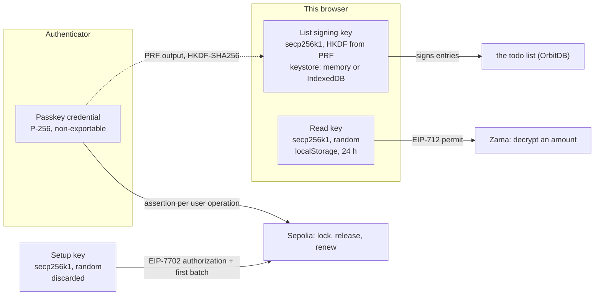

# Four keys, one passkey

This chapter says the passkey is the wallet. That is true, and it hides something: once you look,
"the passkey" is four different keys. One lives in the authenticator. One is derived from it. One is
created and thrown away in the same minute. And one is neither derived nor held in hardware — an
ordinary random key that sits in this browser's `localStorage`.

The question that started this page was whether the account signs with the passkey's own P-256 key
or with a key freshly derived from the passkey's PRF output every time. It signs with the credential
key itself: every user operation carries a WebAuthn assertion over the operation's hash, and Sepolia
verifies it. PRF derives the signing key for the todo list, and nothing on the chain. The key worth
worrying about is the fourth one, the read key for Zama's decryption — and this page says why it
exists, what upstream changed in August 2026, and what we will do about it.

What the account is and how it sends transactions is in [passkey-account.md](passkey-account.md).
What leaks despite the encryption is in [security.md](security.md). Where the money comes from is in
[money-flow.md](money-flow.md).

Each section has a simple explanation and a technical one.

- [The four keys](#keys-simple)
- [What signs a transaction](#transaction-simple)
- [Why there is a read key at all](#read-key-simple)
- [What Zama changed in v0.14](#v014-simple)
- [Measured on 2026-10-02](#measured-on-2026-10-02)
- [How we proceed](#how-we-proceed)

## The four keys

### Keys: simple

| Key                          | Where it lives                                                       | What it may do                                    | When it ends                                                      |
| ---------------------------- | -------------------------------------------------------------------- | ------------------------------------------------- | ----------------------------------------------------------------- |
| the passkey itself           | the authenticator, and nowhere else                                  | everything the account does: lock, release, renew | never; losing it loses the account                                |
| the signing key for the list | this browser, derived from the passkey; kept on disk if data is kept | sign todos, so others see who wrote them          | with the tab, or never if kept; the same passkey derives it again |
| the setup key                | memory, for one minute                                               | put the account's code in place, once             | thrown away as soon as the passkey is registered                  |
| the read key                 | this browser's storage, in plain text                                | ask Zama to decrypt amounts this account may see  | after 24 hours                                                    |

Only the first one can move money, and it never leaves the hardware. The third one is gone. The
other two can be written down in plain text, and that is what this page is about. The read key
always is, for 24 hours; whoever copies it can read amounts and nothing else. The list signing key
is written down only if the reader chose to keep data on the first screen; whoever copies it can
write todos as that identity, and move nothing.

### Keys: technical

1. **The passkey credential.** P-256 in the authenticator. Its uncompressed public key is the DID
   ([passkey-account.md](passkey-account.md#overview-technical)) and the account's admin key in
   Calibur. The private half never leaves the device and is not extractable, so every signature is
   an assertion the authenticator produces after user verification.
2. **The list signing key.** secp256k1, as OrbitDB's keystore wants it, derived by the provider: PRF
   output → HKDF-SHA256 with an info string that carries the DID. With PRF the same passkey derives
   the same key on any device; without PRF the keystore generates one instead. Where it is kept
   follows the storage choice: in memory it goes with the tab; if the reader chose to keep data, it
   sits unencrypted in OrbitDB's keystore in IndexedDB and later sessions sign without asking the
   passkey ([`src/lib/p2p.js`](../src/lib/p2p.js) 362-385). It signs database entries, never a
   transaction.
3. **The setup key.** secp256k1 from `generatePrivateKey()`, created in the wallet package's
   `createCaliburPasskeySetup` (`src/setup.js:200`). Its address _becomes_ the account's address; it
   signs the EIP-7702 authorization and the first batch, then `discard()` drops every reference.
   Calibur keeps that address as a root key it cannot revoke — the limit is written down in
   [passkey-account.md](passkey-account.md#limits-technical).
4. **The read key.** secp256k1 from `generatePrivateKey()`, created in
   [`src/lib/budget-service-zama.js`](../src/lib/budget-service-zama.js) 142 (setup) and 459
   (renewal), stored as `session: { address, privateKey }` in
   [`src/lib/chain/account-store.js`](../src/lib/chain/account-store.js) under
   `simpleTodo.chainAccount.v1.<DID>`. The account delegates user decryption to it per contract and
   until an expiry; it signs EIP-712 permits and is not registered in Calibur, so it can move
   nothing. Details, including what the delegation makes public, in
   [The read key](passkey-account.md#read-key-technical).

Nothing in the wallet path is derived from PRF, and nothing in the PRF path touches the chain. The
two are separate on purpose: a key that signs money should be one the browser cannot read, and a key
that signs thousands of list entries should not need a fingerprint each time.

## What signs a transaction

### Transaction: simple

Every transaction of this account is confirmed with the passkey, on the spot. The browser builds the
operation, hands its fingerprint to the authenticator, and the authenticator answers with a
signature over exactly those bytes. Sepolia checks that signature against the public key the account
was set up with. No key in the browser could produce it.

### Transaction: technical

`signUserOperation` in the wallet package (`src/account.js` 209-220) computes
`getUserOperationHash({ chainId, entryPointAddress, entryPointVersion, userOperation })`, has the
passkey sign those 32 bytes with `signP256Challenge(descriptor, hexToBytes(hash))`, and returns
`encodeUserOperationSignature({ keyHash, signature: encodeWebAuthnAuth(assertion) })`. The
descriptor comes from `getP256CredentialDescriptor(credential)`
([`src/lib/chain/sepolia-chain.js`](../src/lib/chain/sepolia-chain.js) 118-119) and carries
`credentialId`, `rawCredentialId`, `x`, `y`, `rpId` and `userVerification: 'required'` — the public
half only. On chain, Calibur verifies the assertion with webauthn-sol's `WebAuthnAuth`
([security.md](security.md#passkey-wallet-technical)).

So: one WebAuthn assertion per user operation, over the operation's own hash. This is the answer to
the question at the top — the account is a genuine P-256 passkey account, not a key derived from
PRF and used as if it were one.

## Why there is a read key at all

### Read key: simple

Reading an amount needs a signed permission for Zama's key holders, and the account should sign it.
Until now it could not: Zama's version on Sepolia accepts only signatures of classic Ethereum keys.
So the app creates an extra key, gives it a time-limited power of attorney for reading, and that key
signs the permissions. It cannot lock, release or transfer anything.

The cost is that this key has to be written down, because a read should not cost a fingerprint. It
sits in the browser's storage in plain text for up to 24 hours. Whoever gets at that browser profile
can read amounts in that window — and move nothing.

### Read key: technical

Zama's permit is an EIP-712 message of type `DelegatedUserDecryptRequestVerification`, signed by the
delegate and bound to a transport public key, a set of contracts and a time window. Protocol v0.13
verifies it with `ecrecover`, so a 65-byte ECDSA signature is the only shape it accepts; a Calibur
account's signature is an ERC-1271 proof in ERC-7739 form and would be rejected. The delegation is
`ACL.delegateForUserDecryption(read key, contract, expiry)`, once for the escrow and once for
cUSDTMock, with `READ_KEY_TTL_SECONDS` = 24 h from
[`src/lib/chain/config.js`](../src/lib/chain/config.js).

A second key sits next to it and is easy to miss: the SDK's **transport key pair** (ML-KEM), whose
public half is bound into the permit and whose private half reconstructs the plaintext from the KMS
shares. Here it costs nothing on disk:
[`src/lib/chain/zama-client.js`](../src/lib/chain/zama-client.js) hands the SDK `storage: new
MemoryStorage()`, so the transport key pair and the permit live as long as the page. The SDK's own
default would be IndexedDB with a 30-day TTL (`transportKeyPairTTL`, `permitTTL`). Memory only is
cheap today because the read key signs every fresh permit without a prompt; it stops being cheap
once the passkey signs the permits (step 3 below). Zama's security guide is explicit about where
such bytes belong when they are kept:

> **Acceptable:** encrypted storage, a secure enclave, or the browser credential store.
> **Risky:** plain `localStorage`, which is readable by any script on the domain.
> **Never:** URL parameters, cookies, or unencrypted server-side storage.

Our contract-scoped delegation and our 24 hours follow the rest of that guide ("keep permit scope
minimal", "short `durationSeconds`"). The storage medium is the part it would call risky.

## What Zama changed in v0.14

### v0.14: simple

Since August 2026 Zama's protocol can also check a signature that comes from a smart account instead
of a plain key. That is exactly what was missing: the passkey account could then sign the reading
permission itself, and the extra key would not be needed at all. They test it against Safe accounts,
so smart accounts are a supported case now, not a trick.

It is not usable for us yet. The part that has to run on the chain we use is not deployed, and the
SDK version we depend on does not carry the new code. So the read key stays for now — not as a
mistake, but as the workaround for a limit that is being lifted.

### v0.14: technical

From the fhevm v0.14.0 release notes (2026-08-14):

> Shipped unified EIP-712 user decryption. Self and delegated decryption share one request model,
> with per-handle ownership, durationSeconds, protocol-versioned permits, ERC-1271 smart-account
> signatures, and context-ID validation on the unified path.

In the SDK this is `verifyErc1271UserDecrypt`: a 65-byte signature is still checked locally with
`ecrecover`, anything else by a STATICCALL to `IERC1271(userAddress).isValidSignature(digest,
signature)`, accepted only on the magic value `0x1626ba7e`; the KMS re-verifies independently and
stays authoritative. The permit itself moved to `signUnifiedDecryptionPermit`, with
`canUseUnifiedDecryptionPermit` as the capability probe and `durationDays` replaced by
`durationSeconds`. The v0.14.1 line adds "make the ERC-1271 Safe suite viable on Sepolia".

Calibur can hold the other end of that: its keys are Secp256k1, P-256 or WebAuthnP256, and its
`isValidSignature` accepts ECDSA from `address(this)` plus ERC-7739 nested typed-data and personal
signatures. Whether a Calibur WebAuthn signature passes Zama's verifier in practice is untested —
it cannot be tested until the route exists.

## Measured on 2026-10-02

| What                                                              | Result                                                                                      |
| ----------------------------------------------------------------- | ------------------------------------------------------------------------------------------- |
| `@zama-fhe/sdk` 3.6.0 (ours)                                      | depends on `@fhevm/sdk` 0.13.2; no ERC-1271 symbol in the published package                 |
| `@zama-fhe/sdk` 3.7.0-beta.5                                      | also 0.13.2 — the beta does not bring it                                                    |
| `@zama-fhe/sdk` 4.0.0-alpha.1                                     | `@fhevm/sdk` 0.14.1-1; `canUseUnifiedDecryptionPermit` and the `Erc1271` errors are present |
| `@fhevm/sdk` released                                             | `latest` 0.13.7; the 0.14 line is published under `alpha` only                              |
| `POST https://relayer.testnet.zama.org/v2/user-decrypt` with `{}` | HTTP **400**                                                                                |
| `POST https://relayer.testnet.zama.org/v3/user-decrypt` with `{}` | HTTP **404**                                                                                |

That relayer is the one this chapter uses: the SDK's chain entry for 11155111 sets
`relayerUrl: https://relayer.testnet.zama.org`. The SDK probes the unified route exactly this way —
an empty request answers 400 if the route is there, 404 if it is not — so the 404 says the unified
path is not deployed for Sepolia. Even on SDK 4.0.0-alpha.1, `canUseUnifiedDecryptionPermit` would
return false today. [zama-ai/sdk#684](https://github.com/zama-ai/sdk/pull/684), merged 2026-09-04,
wires the v1/v2 branching into `grantPermit` and says plainly that the `@fhevm/sdk` bump comes
separately.

The capability probe, not a date, is the trigger for the next step.

## How we proceed

Three ways out, in the order they make sense. The roadmap with its steps and done-criteria is
[Le-Space/simple-todo#54](https://github.com/Le-Space/simple-todo/issues/54).

1. **Seal the read key with a key derived from the passkey.** Independent of Zama, available now,
   and the same sealing is what step 3 needs to keep a permit and its transport key pair across a
   reload. Both halves already
   exist in our own packages: the wallet's `createZamaSessionKey()` returns a `seal(sealingKey)` and
   `openZamaSessionKey(sealed, sealingKey)` takes it back, with the address bound to the ciphertext
   as associated data; the identity provider has `wrapSKWithPRF` / `unwrapSKWithPRF`. The app simply
   does not use them yet.
2. **A key the browser cannot read.** WebCrypto can hold a non-extractable `CryptoKey` in IndexedDB,
   which signs but never exports — the usual hardening in the account-abstraction world. It does not
   help against an active XSS, which can still _use_ the key, and WebCrypto has no secp256k1 — its
   ECDSA curves are the NIST ones, and of those Calibur takes P-256. So this one only becomes
   possible together with step 3, through Calibur's standalone P-256 key type.
3. **No read key at all.** Once `canUseUnifiedDecryptionPermit` reports true for Sepolia, the
   passkey account signs the permit itself over ERC-1271, and both the key and the ACL delegation go
   away. One passkey confirmation per permit, not per read — and per page load as long as the permit
   lives only in memory, which is why step 1's sealing carries over: a sealed permit and transport
   key pair in the SDK's `GenericStorage` survive the reload.

Two conclusions worth writing down, because they are easy to get wrong:

- **PRF belongs here as a wrapping key, not as a signing key.** Deriving the read key itself from
  PRF would give the same address on every device, which is convenient, but it drops the per-device,
  time-boxed property and the key is in memory the moment it is derived. Deriving an AES-GCM key and
  encrypting what we store keeps both properties, and the same key can later seal a kept permit.
- **Separate the contexts in HKDF, not in the PRF input.** The provider's PRF input is fixed per
  relying party (`orbitdb-identity-provider-webauthn-did:prf:v2`), and a second PRF input would mean
  a second assertion, which means another prompt. The sealing key comes from the _same_ PRF output
  with a different HKDF info. Whether that costs a prompt depends on the storage choice: in memory
  mode every session already reads the PRF output to derive the list signing key, but the provider
  does not hand that output out, and `extractPrfSeedFromCredential` makes an assertion of its own.
  One touch for both is possible if the app reads PRF once, derives both keys, and puts the signing
  key into the keystore before the provider looks — the pattern `seedRestoredSigningKey` already
  uses after a restore. That read must pass the fixed PRF input (`credential.prfInput`); without it
  `extractPrfSeedFromCredential` falls back to random bytes, and the sealing key would never come
  back. When data is kept, the provider finds the signing key in the keystore and asks the passkey
  for nothing (`ensureDerivedSigningKey` returns `'existing'`), so opening the sealed read key costs
  one touch per session, the first time an amount is shown. Today that read costs none; this is the
  price. Where PRF is unavailable the read key has to stay in memory for the session instead.

This answers item 6 of [passkey-account.md](passkey-account.md#open-issues) ("Zama v0.14: wait for
it and check whether the passkey itself can permit decryptions"): the mechanism exists, the route
does not yet. Item 3 ("Read key: seal it instead of storing it in plain text") is now the first step
rather than a wish.

## Sources

Code:

- [`src/lib/chain/sepolia-chain.js`](../src/lib/chain/sepolia-chain.js) 118-119: the credential
  descriptor handed to the wallet
- [`src/lib/budget-service-zama.js`](../src/lib/budget-service-zama.js) 142, 459: the read key at
  setup and at renewal
- [`src/lib/chain/account-store.js`](../src/lib/chain/account-store.js): what this browser keeps
- [`src/lib/chain/config.js`](../src/lib/chain/config.js): `READ_KEY_TTL_SECONDS`
- [`src/lib/p2p.js`](../src/lib/p2p.js) 362-385: the PRF-derived signing key for the list and where
  it is kept
- [`src/lib/chain/zama-client.js`](../src/lib/chain/zama-client.js): the SDK with `MemoryStorage`
- `@le-space/passkey-wallet` (tarball in [`vendor/`](../vendor), commit `cde6878`): `src/account.js`
  209-220 (`signUserOperation`), `src/setup.js` 200 (the setup key), `src/zama.js`
  (`createZamaSessionKey`, `openZamaSessionKey`, `getRevokeDelegationForUserDecryptionCalls`)
- `@le-space/orbitdb-identity-provider-webauthn-did` 0.8.0: `src/keystore/encryption.js`
  (`wrapSKWithPRF`, `unwrapSKWithPRF`), `src/keystore/derived-signing-key.js` (HKDF-SHA256,
  `ensureDerivedSigningKey`), `src/webauthn/prf-input.js` (`PRF_INPUT_INFO`),
  `src/standalone/webauthn/credential.js` (`extractPrfSeedFromCredential`)

Upstream, read on 2026-10-02:

- [fhevm releases](https://github.com/zama-ai/fhevm/releases): v0.14.0 (2026-08-14) unified
  decryption and ERC-1271; v0.14.1-0 and v0.14.1 the ERC-1271 Safe suite on Sepolia
- `zama-ai/fhevm`, `sdk/js-sdk/docs/security.md` and `docs/decryption.md`: where to store transport
  keys, permit scope, the ERC-1271 note, `GenericStorage`
- `sdk/js-sdk/docs/release-notes.md`, v0.14.1-0 (2026-08-24): `verifyErc1271UserDecrypt`,
  `canUseUnifiedDecryptionPermit`, the typed `Erc1271*` errors
- [zama-ai/sdk#684](https://github.com/zama-ai/sdk/pull/684) (merged 2026-09-04): v1/v2 permit
  branching, the deferred `@fhevm/sdk` bump
- [Zama protocol changelog](https://docs.zama.org/protocol/changelog)
- [Uniswap Calibur audit](https://www.openzeppelin.com/news/uniswap-calibur-audit),
  [ERC-1271](https://eips.ethereum.org/EIPS/eip-1271),
  [ERC-7739](https://ethereum-magicians.org/t/erc-7739-readable-typed-signatures-for-smart-accounts/20513)
- [Yubico: developer's guide to
  PRF](https://developers.yubico.com/WebAuthn/Concepts/PRF_Extension/Developers_Guide_to_PRF.html),
  [Corbado on passkeys and PRF](https://www.corbado.com/blog/passkeys-prf-webauthn)
