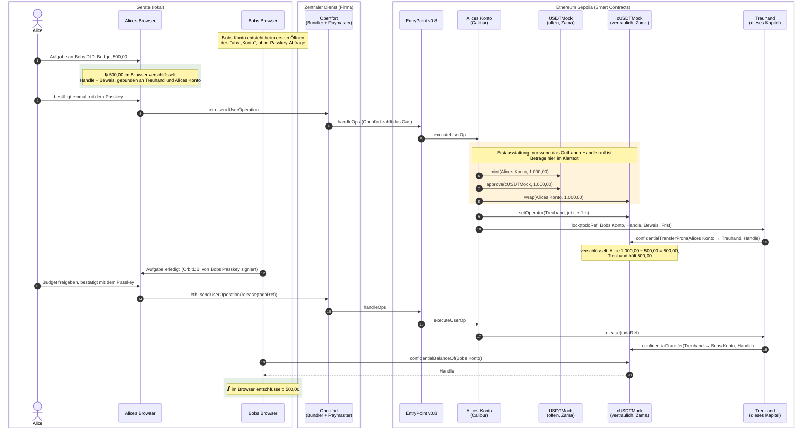

# Woher das Geld kommt

Diese Seite verfolgt einen einzigen Betrag durch das Kapitel `escrow01`: die 500,00 cUSDT, die Alice
für eine delegierte Aufgabe sperrt und an Bob freigibt. Sie beantwortet drei Fragen, die in einer
Vorführung sofort kommen: Woher kommt das Geld überhaupt? Wem gehören die Token-Verträge? Und warum
zeigt Etherscan auf der Kontoseite nichts an?

Was die Treuhand tut, steht in [escrow.de.md](escrow.de.md). Wie das Passkey-Konto Transaktionen
sendet und wo verschlüsselt und entschlüsselt wird, steht mit Sequenzdiagrammen in
[passkey-account.de.md](passkey-account.de.md). Zamas Protokoll erklärt
[zama-confidential-transactions.de.md](zama-confidential-transactions.de.md), und was trotz
Verschlüsselung nach außen dringt, steht in [security.de.md](security.de.md).

Jeder Abschnitt hat eine einfache Erklärung und eine technische.

- [Der Weg des Geldes](#weg-einfach)
- [Wem die Token-Verträge gehören](#token-einfach)
- [Was dabei öffentlich wird](#öffentlich-einfach)
- [Warum Etherscan auf der Kontoseite nichts zeigt](#etherscan-einfach)
- [Der Lauf vom 2026-09-22](#der-lauf-vom-2026-09-22)
- [Was die App davon sagt](#was-die-app-davon-sagt)

## Der Weg des Geldes

### Weg: einfach

Niemand lädt vorher Geld auf. Alices Konto ist leer, bis sie zum ersten Mal ein Budget sperrt. In
genau dieser Transaktion holt sich ihr Konto 1.000,00 Test-Token aus einem offenen Automaten, packt
sie in das vertrauliche Token um und legt 500,00 davon in die Treuhand. Alice behält 500,00. Gibt sie
später frei, bucht die Treuhand die 500,00 auf Bobs Konto. Bobs Browser entschlüsselt sie und zeigt
sie an.

Bobs Konto muss dafür schon existieren. Es entsteht still, sobald Bob den Tab „Konto“ zum ersten Mal
öffnet, und kostet ihn nichts: Die Gebühren zahlt in diesem Kapitel durchgehend Openfort.

### Weg: technisch

Die Erstausstattung hängt an einer einzigen Bedingung. `lock` in
[`src/lib/budget-service-zama.js`](../src/lib/budget-service-zama.js) fragt vorher
`confidentialBalanceOf` ab; ist das Handle `bytes32(0)`, hat das Konto noch nie vertrauliches Geld
gesehen, und die drei Aufrufe `mint`, `approve` und `wrap` werden der UserOperation vorangestellt
([`chain/sepolia-chain.js`](../src/lib/chain/sepolia-chain.js), `calls.funding`). Der Betrag steht als
`STARTING_FUNDS` in [`chain/config.js`](../src/lib/chain/config.js): 1.000,00 bei 6 Nachkommastellen.
Ab der zweiten Sperre entfällt der Block, und ein Konto ohne Deckung sperrt eine verschlüsselte Null
([ungedeckte Sperre](escrow.de.md#ungedeckte-sperre-einfach)).

Sperre und Freigabe sind je eine UserOperation nach ERC-4337 mit je einer Passkey-Abfrage. Wie sie
signiert und eingereicht wird, steht in [passkey-account.de.md](passkey-account.de.md#sperren-technisch).

## Wem die Token-Verträge gehören

### Token: einfach

Das Geld in dieser Vorführung ist Zamas Testgeld, nicht unser eigenes. Wir stellen nur die Treuhand.
Das offene Token hat einen Automaten, den jeder bedienen darf, und das vertrauliche Token ist eine
Hülle darum: Man gibt offene Token hinein und bekommt dieselbe Menge vertraulich zurück.

### Token: technisch

| Vertrag                             | Adresse auf Sepolia                          | Wessen Vertrag | Rolle                                                                                                        |
| ----------------------------------- | -------------------------------------------- | -------------- | ------------------------------------------------------------------------------------------------------------ |
| `USDTMock` (ERC-20, offen)          | `0xa7dA08FafDC9097Cc0E7D4f113A61e31d7e8e9b0` | Zama           | `mint` darf jeder aufrufen, bis 1.000.000 Token je Aufruf. Beträge stehen im Klartext auf der Chain.         |
| `cUSDTMock` (ERC-7984, vertraulich) | `0x4E7B06D78965594eB5EF5414c357ca21E1554491` | Zama           | `ConfidentialWrapper` über `USDTMock`, Rate 1, 6 Nachkommastellen. Guthaben und Überweisungen verschlüsselt. |
| `ConfidentialTodoEscrow`            | `0x6Ee3Fa9d3aEdaAD189F5DeA9d859605c9D743429` | dieses Kapitel | Hält das gesperrte Budget, kennt Frist, Begünstigten und Prüfstelle.                                         |

Es wird also nichts „als cUSDT geprägt“. Geprägt wird das offene `USDTMock`; das vertrauliche cUSDT
entsteht erst durch `wrap` in Zamas Wrapper. Welchen Token die Treuhand nimmt, steht beim
Bereitstellen fest (`ESCROW_TOKEN` in `contracts/.env`, sonst Zamas cUSDTMock) und ist danach
unveränderlich; verlangt wird nur, dass er ERC-7984 über ERC-165 meldet
([contracts/README.md](../contracts/README.md#sepolia-runbook)). In der App steht dieselbe Adresse
als Konstante in [`chain/config.js`](../src/lib/chain/config.js).

Die Dateien in [`contracts/src/mocks/`](../contracts/src/mocks) sind Nachbauten für die Testsuite,
`USDTMock.sol` und `ConfidentialUSDTMock.sol`. Sie laufen nur in
[`contracts/test/`](../contracts/test) und sind auf Sepolia nirgends bereitgestellt.

Dass der Token fremder Code ist, hat eine Folge für das Vertrauensmodell: Der Owner von `cUSDTMock`,
Zamas Protocol DAO, kann Observer eintragen, und ein Observer darf jeden Betrag entschlüsseln, den
der Token je zurückgegeben hat. Das steht ausführlich in
[security.de.md](security.de.md) und in [contracts/README.md](../contracts/README.md). Im Echtbetrieb
stünde an dieser Stelle kein Automaten-Token, sondern ein tokenisiertes Guthaben oder ein Stablecoin;
an der Treuhand und an der Verschlüsselung ändert das nichts.

## Was dabei öffentlich wird

### Öffentlich: einfach

Zwei Zahlen sind für jeden lesbar: dass 1.000,00 geprägt und dass 1.000,00 in das vertrauliche Token
umgepackt wurden. Ab da hört es auf. Wie viel gesperrt und wie viel an Bob ausgezahlt wurde, steht
nirgends als Zahl, sondern nur als Verweis auf einen verschlüsselten Wert.

### Öffentlich: technisch

Öffentlich im Klartext:

- `Transfer(0x0 → Alices Konto, 1000000000)` auf `USDTMock` und der `Transfer` desselben Betrags in
  den Wrapper. Etherscan zeigt beide unter „ERC-20 Tokens Transferred“ der Sperr-Transaktion, das
  `Approval` dazwischen steht in den Logs.
- Die Beteiligten: `Locked(creator, todoRef, beneficiary, deadline)` und `Released(creator, todoRef,
beneficiary)` nennen beide Adressen und die Frist.

Nur als Handle, also verschlüsselt:

- der gesperrte Betrag im `ConfidentialTransfer` des Tokens und im Speicher der Treuhand,
- Alices Restguthaben und Bobs neues Guthaben.

Wer die 1.000,00 sieht, weiß damit eine Obergrenze: Alice kann höchstens so viel gesperrt haben.
Welche Stellen beim Verpacken und Entpacken sonst noch Beträge zeigen, zählt
[escrow.de.md](escrow.de.md#verpacken-und-entpacken-einfach) auf.

## Warum Etherscan auf der Kontoseite nichts zeigt

### Etherscan: einfach

Der erste Tab einer Adresse listet nur Transaktionen, die diese Adresse selbst abschickt. Ein
Passkey-Konto schickt aber nie selbst etwas: Das übernimmt der Bundler. Und die Gutschrift ist kein
gewöhnlicher Token-Transfer, weil der Betrag verschlüsselt ist. Also bleiben beide Tabs leer,
obwohl alles auf der Chain steht.

### Etherscan: technisch

- **Transactions**: leer. Absender jeder Transaktion ist der Bundler von Openfort, Empfänger der
  EntryPoint `0x4337084D9E255Ff0702461CF8895CE9E3b5Ff108`. Das Konto erscheint nur als `sender` im
  `UserOperationEvent`.
- **Token Transfers (ERC-20)**: leer. `cUSDTMock` meldet
  `ConfidentialTransfer(from, to, bytes32 amount)`, kein ERC-20-`Transfer`. Etherscan indiziert das
  nicht als Token-Transfer.
- **Other Transactions → Authorizations (EIP-7702)**: hier steht, dass das Konto auf Calibur
  `0x000000009B1D0aF20D8C6d0A44e162d11F9b8f00` delegiert wurde.
- **Other Transactions → AA Transactions (ERC-4337)**: hier stehen die UserOperations des Kontos.

Sichtbar wird der Vorgang außerdem auf den Vertragsseiten: unter „Events“ der Treuhand stehen
`Locked` und `Released`, und in der Transaktion selbst stehen alle Logs beieinander.

## Der Lauf vom 2026-09-22

Die Vorführung vom 2026-09-22 zwischen 13:11 und 13:34 MESZ, mit Alices Konto
`0xe5B81A3B…CD13` und Bobs Konto `0x0f741fE3…60c5`:

| Schritt              | Transaktion                                                                                                         | Block    | Was darin steht                                                                                                             |
| -------------------- | ------------------------------------------------------------------------------------------------------------------- | -------- | --------------------------------------------------------------------------------------------------------------------------- |
| Bobs Konto aktiviert | [`0x131c3db1…`](https://sepolia.etherscan.io/tx/0x131c3db1352232b65c5a6fce61832a248ca19c1eea25e160ea20e3a5da7adfe1) | 11757521 | Transaktionstyp 4: die EIP-7702-Autorisierung auf Calibur, dazu Bobs erste UserOperation.                                   |
| Alice sperrt 500,00  | [`0xf37bda9d…`](https://sepolia.etherscan.io/tx/0xf37bda9d2caf9fe9048a675cc9c29300ee0e1e93265801d96dfc1a156a487d9f) | 11757620 | `mint` von 1.000,00 an Alices Konto, `approve`, `wrap`, dann `setOperator` und `lock`. 1.164.274 Gas, gezahlt von Openfort. |
| Alice gibt frei      | [`0x8fec7053…`](https://sepolia.etherscan.io/tx/0x8fec7053f23e9f2c857ba4662ebb1d69fb522db575cd062731286a3148a11bb3) | 11757632 | `Released` der Treuhand und `ConfidentialTransfer` an Bobs Konto, Betrag nur als Handle.                                    |

Danach zeigt Bobs Tab „Konto“ 500,00 cUSDT, in seinem Browser entschlüsselt. Ein zweiter, älterer
Lauf mit Skripten statt App steht Transaktion für Transaktion in
[smoke-test.de.md](smoke-test.de.md).

## Was die App davon sagt

Im Tab „Konto“ steht unter der Adresse ein Satz: „Ihr Passkey ist der Admin-Schlüssel dieses Kontos.
Mit dem ersten Sperren kommen 1.000,00 Test-cUSDT darauf.“ Das ist die einzige Stelle in der
Oberfläche, an der die Erstausstattung vorkommt. Beim Anlegen einer Aufgabe mit Budget und beim
Sperren steht nichts davon.

Offen: Der Satz erscheint auf jedem eingerichteten Konto, auch bei Empfängern. Bob hat nie gesperrt,
sein Guthaben stammt aus der Auszahlung, und trotzdem steht bei ihm die Prägung. Der Satz gehört nur
auf Konten, die noch nie gesperrt haben; Empfänger brauchen einen eigenen.

## Quellen

- [`src/lib/budget-service-zama.js`](../src/lib/budget-service-zama.js): Erstausstattung, Sperre,
  Freigabe, Leseschlüssel
- [`src/lib/chain/sepolia-chain.js`](../src/lib/chain/sepolia-chain.js): die Aufrufe `funding`,
  `lock`, `release`
- [`src/lib/chain/config.js`](../src/lib/chain/config.js): Adressen, `STARTING_FUNDS`, Fristen
- [contracts/README.md](../contracts/README.md): Treuhand, Sepolia-Runbook, Token-Anforderungen
- [EIP-7702](https://eips.ethereum.org/EIPS/eip-7702), [ERC-4337](https://eips.ethereum.org/EIPS/eip-4337),
  [ERC-7984](https://eips.ethereum.org/EIPS/eip-7984)
