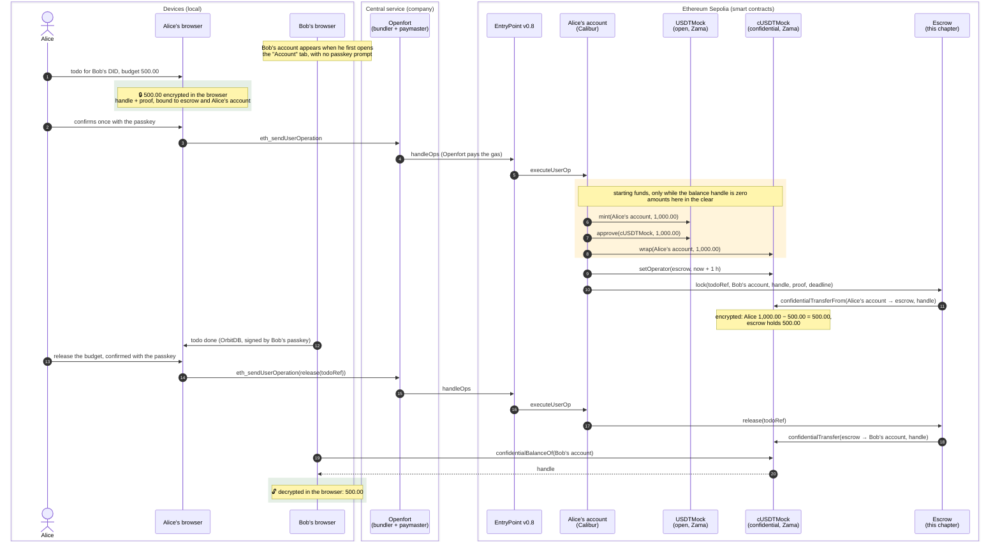

# Where the money comes from

This page follows a single amount through the `escrow01` chapter: the 500.00 cUSDT Alice locks for a
delegated todo and releases to Bob. It answers the three questions a demo always raises. Where does
the money come from? Whose token contracts are these? And why does Etherscan show nothing on the
account page?

What the escrow does is in [escrow.md](escrow.md). How the passkey account sends transactions, and
where amounts are encrypted and decrypted, is in [passkey-account.md](passkey-account.md), with
sequence diagrams. Zama's protocol is in
[zama-confidential-transactions.md](zama-confidential-transactions.md), and what leaks despite the
encryption is in [security.md](security.md).

Each section has a simple explanation and a technical one.

- [The path of the money](#path-simple)
- [Whose token contracts these are](#tokens-simple)
- [What becomes public](#public-simple)
- [Why Etherscan's account page looks empty](#etherscan-simple)
- [The run of 2026-09-22](#the-run-of-2026-09-22)
- [What the app says about it](#what-the-app-says-about-it)

## The path of the money

### Path: simple

Nobody tops up an account first. Alice's account is empty until she locks a budget for the first
time. In that very transaction her account takes 1,000.00 test tokens from an open faucet, wraps them
into the confidential token and locks 500.00 of them in the escrow. Alice keeps 500.00. When she
releases later, the escrow moves the 500.00 to Bob's account, and Bob's browser decrypts and shows
them.

Bob's account has to exist by then. It is created quietly the first time he opens the "Account" tab,
and costs him nothing: throughout this chapter Openfort pays the fees.

### Path: technical

The starting funds hang on a single condition. `lock` in
[`src/lib/budget-service-zama.js`](../src/lib/budget-service-zama.js) reads `confidentialBalanceOf`
first; if the handle is `bytes32(0)`, the account has never held confidential money, and the three
calls `mint`, `approve` and `wrap` are prepended to the user operation
([`chain/sepolia-chain.js`](../src/lib/chain/sepolia-chain.js), `calls.funding`). The amount is
`STARTING_FUNDS` in [`chain/config.js`](../src/lib/chain/config.js): 1,000.00 at 6 decimals. From the
second lock on the block is gone, and an account without cover locks an encrypted zero
([underfunded lock](escrow.md#underfunded-lock-simple)).

Lock and release are one ERC-4337 user operation each, with one passkey prompt each. How one is
signed and submitted is in [passkey-account.md](passkey-account.md#locking-technical).

## Whose token contracts these are

### Tokens: simple

The money in this demo is Zama's test money, not ours. We only provide the escrow. The open token has
a faucet anyone may use, and the confidential token is a wrapper around it: put open tokens in, get
the same amount back confidentially.

### Tokens: technical

| Contract                             | Address on Sepolia                           | Whose        | Role                                                                                               |
| ------------------------------------ | -------------------------------------------- | ------------ | -------------------------------------------------------------------------------------------------- |
| `USDTMock` (ERC-20, open)            | `0xa7dA08FafDC9097Cc0E7D4f113A61e31d7e8e9b0` | Zama         | Anyone may call `mint`, up to 1,000,000 tokens a call. Amounts sit on the chain in the clear.      |
| `cUSDTMock` (ERC-7984, confidential) | `0x4E7B06D78965594eB5EF5414c357ca21E1554491` | Zama         | A `ConfidentialWrapper` over `USDTMock`, rate 1, 6 decimals. Balances and transfers are encrypted. |
| `ConfidentialTodoEscrow`             | `0x6Ee3Fa9d3aEdaAD189F5DeA9d859605c9D743429` | this chapter | Holds the locked budget, knows the deadline, the beneficiary and the auditor.                      |

So nothing is "minted as cUSDT". What is minted is the open `USDTMock`; the confidential cUSDT only
comes into being through `wrap` in Zama's wrapper. Which token the escrow uses is fixed at deployment
(`ESCROW_TOKEN` in `contracts/.env`, otherwise Zama's cUSDTMock) and immutable afterwards; the only
requirement is that it declares ERC-7984 through ERC-165
([contracts/README.md](../contracts/README.md#sepolia-runbook)). The app keeps the same address as a
constant in [`chain/config.js`](../src/lib/chain/config.js).

The files in [`contracts/src/mocks/`](../contracts/src/mocks), `USDTMock.sol` and
`ConfidentialUSDTMock.sol`, are stand-ins for the test suite. They run only in
[`contracts/test/`](../contracts/test) and are deployed nowhere on Sepolia.

That the token is somebody else's code has a consequence for the trust model: the owner of
`cUSDTMock`, Zama's Protocol DAO, can register observers, and an observer may decrypt every amount
the token ever returned. [security.md](security.md) and
[contracts/README.md](../contracts/README.md) spell that out. In production this would not be a
faucet token but a tokenized deposit or a stablecoin; that changes neither the escrow nor the
encryption.

## What becomes public

### Public: simple

Two numbers are readable by anyone: that 1,000.00 were minted, and that 1,000.00 were wrapped into
the confidential token. That is where it stops. How much was locked, and how much Bob was paid,
appears nowhere as a number, only as a reference to an encrypted value.

### Public: technical

Public, in the clear:

- `Transfer(0x0 → Alice's account, 1000000000)` on `USDTMock` and the `Transfer` of the same amount
  into the wrapper. Etherscan shows both under "ERC-20 Tokens Transferred" of the lock transaction;
  the `Approval` between them is in the logs.
- Who takes part: `Locked(creator, todoRef, beneficiary, deadline)` and `Released(creator, todoRef,
beneficiary)` name both addresses and the deadline.

Encrypted, as a handle only:

- the locked amount in the token's `ConfidentialTransfer` and in the escrow's storage,
- Alice's remaining balance and Bob's new balance.

Anyone who sees the 1,000.00 therefore knows an upper bound: Alice can have locked at most that much.
Which other places show amounts around wrapping and unwrapping is listed in
[escrow.md](escrow.md#wrap-and-unwrap-simple).

## Why Etherscan's account page looks empty

### Etherscan: simple

An address's first tab lists only transactions that address sends itself. A passkey account never
sends anything itself: the bundler does that. And the payout is not an ordinary token transfer,
because the amount is encrypted. So both tabs stay empty although everything is on the chain.

### Etherscan: technical

- **Transactions**: empty. Every transaction is sent by Openfort's bundler to the EntryPoint at
  `0x4337084D9E255Ff0702461CF8895CE9E3b5Ff108`. The account only shows up as the `sender` of a
  `UserOperationEvent`.
- **Token Transfers (ERC-20)**: empty. `cUSDTMock` emits
  `ConfidentialTransfer(from, to, bytes32 amount)`, not an ERC-20 `Transfer`, and Etherscan does not
  index that as a token transfer.
- **Other Transactions → Authorizations (EIP-7702)**: here is the delegation of the account to
  Calibur at `0x000000009B1D0aF20D8C6d0A44e162d11F9b8f00`.
- **Other Transactions → AA Transactions (ERC-4337)**: here are the account's user operations.

The contract pages show it too: the escrow's "Events" tab carries `Locked` and `Released`, and the
transaction itself has all the logs in one place.

## The run of 2026-09-22

The demo of 2026-09-22, between 11:11 and 11:34 UTC, with Alice's account `0xe5B81A3B…CD13` and
Bob's account `0x0f741fE3…60c5`:

| Step                    | Transaction                                                                                                         | Block    | What is in it                                                                                                             |
| ----------------------- | ------------------------------------------------------------------------------------------------------------------- | -------- | ------------------------------------------------------------------------------------------------------------------------- |
| Bob's account activated | [`0x131c3db1…`](https://sepolia.etherscan.io/tx/0x131c3db1352232b65c5a6fce61832a248ca19c1eea25e160ea20e3a5da7adfe1) | 11757521 | A type 4 transaction: the EIP-7702 authorization to Calibur, plus Bob's first user operation.                             |
| Alice locks 500.00      | [`0xf37bda9d…`](https://sepolia.etherscan.io/tx/0xf37bda9d2caf9fe9048a675cc9c29300ee0e1e93265801d96dfc1a156a487d9f) | 11757620 | `mint` of 1,000.00 to Alice's account, `approve`, `wrap`, then `setOperator` and `lock`. 1,164,274 gas, paid by Openfort. |
| Alice releases          | [`0x8fec7053…`](https://sepolia.etherscan.io/tx/0x8fec7053f23e9f2c857ba4662ebb1d69fb522db575cd062731286a3148a11bb3) | 11757632 | The escrow's `Released` and a `ConfidentialTransfer` to Bob's account, the amount only as a handle.                       |

After that Bob's "Account" tab shows 500.00 cUSDT, decrypted in his browser. An older run, driven by
scripts rather than the app, is in [smoke-test.md](smoke-test.md), transaction by transaction.

## What the app says about it

The "Account" tab carries one sentence under the address: "Your passkey is this account's admin key.
Its first lock adds 1,000.00 test cUSDT." That is the only place in the interface where the starting
funds appear. Creating a todo with a budget, and locking it, say nothing about them.

Open: the sentence shows on every account that has been set up, recipients included. Bob never
locked, his balance comes from the payout, and the minting line sits on his page all the same. The
sentence belongs only on accounts that have never locked; recipients need one of their own.

## Sources

- [`src/lib/budget-service-zama.js`](../src/lib/budget-service-zama.js): starting funds, lock,
  release, read key
- [`src/lib/chain/sepolia-chain.js`](../src/lib/chain/sepolia-chain.js): the `funding`, `lock` and
  `release` calls
- [`src/lib/chain/config.js`](../src/lib/chain/config.js): addresses, `STARTING_FUNDS`, deadlines
- [contracts/README.md](../contracts/README.md): the escrow, the Sepolia runbook, what a token must
  provide
- [EIP-7702](https://eips.ethereum.org/EIPS/eip-7702), [ERC-4337](https://eips.ethereum.org/EIPS/eip-4337),
  [ERC-7984](https://eips.ethereum.org/EIPS/eip-7984)
